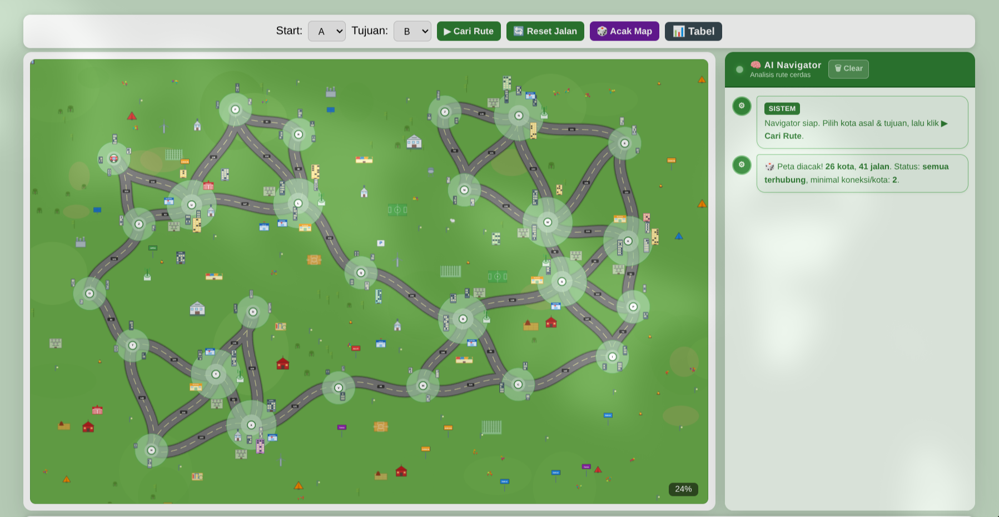
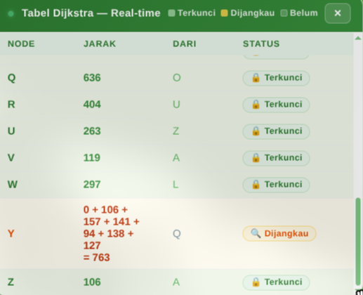

# 🚗 Simulasi Rute Kota — Algoritma Dijkstra

Aplikasi web interaktif untuk visualisasi algoritma Dijkstra dalam mencari rute terpendek antar kota.

## 📸 Fitur Utama

### Peta Interaktif

- Peta kota dengan visualisasi jalan antar node
- Fitur zoom & pan untuk navigasi peta
- Animasi perjalanan kendaraan berwarna merah

### Algoritma Dijkstra

- Pencarian rute terpendek secara visual
- Tabel Dijkstra real-time yang menampilkan proses perhitungan
- Status node: **Terkunci** (hijau), **Dijangkau** (kuning), **Belum** (putih)

### Kondisi Jalan

- **Jalan Rusak** — Menandai jalan yang tidak bisa dilewati
- **Perbaikan** — Jalan dalam proses perbaikan
- **Hujan** — Kondisi cuaca yang mempengaruhi kecepatan
- **Macet** — Kondisi kemacetan

### Kontrol Simulasi

- ▶ **Cari Rute** — Mulai pencarian rute terpendek
- ⏸ **Pause** — Menjeda animasi
- ⏹ **Stop** — Menghentikan simulasi
- ↻ **Ulang** — Mengulang simulasi
- 🔄 **Reset Jalan** — Reset semua kondisi jalan
- 🎲 **Acak Map** — Mengacak posisi kota dan jalan

### AI Navigator

- Sistem chat yang memberikan analisis rute secara real-time
- Memberikan informasi tentang kondisi jalan dan alternatif rute

## 🖥️ Tampilan Aplikasi

Peta utama menampilkan:

- Kota-kota yang terhubung dengan jalan
- Kendaraan animasi saat simulasi berjalan
- Highlight rute terpendek dengan warna hijau cerah

Tabel Dijkstra real-time:

- Menampilkan status setiap node
- Jarak sementara dari node awal
- Node asal untuk setiap rute

Panel kontrol kondisi jalan:

- Pilih tool untuk menandai kondisi jalan
- Clear kondisi untuk mereset

## 🚀 Cara Penggunaan

1. **Pilih Kota** — Pilih kota asal dan tujuan dari dropdown
2. **Cari Rute** — Klik tombol "▶ Cari Rute"
3. **Lihat Proses** — Observasi tabel Dijkstra dan animasi pencarian
4. **Analisis** — Lihat analisis dari AI Navigator di panel chat
5. **Modifikasi** — Tambahkan kondisi jalan untuk simulasi skenario berbeda

## 🛠️ Teknologi

- HTML5 & CSS3
- JavaScript (ES6+)
- SVG untuk visualisasi peta
- Algoritma Dijkstra untuk pencarian rute

## 👥 Tim Pengembang

| Nama   | Branch   | Peran                    |
| ------ | -------- | ------------------------ |
| Rezi   | `rezi`   | Backend & Algoritma      |
| Faiz   | `faiz`   | Frontend UI/UX           |
| Haikal | `haikal` | Animasi & Visualisasi    |
| Wily   | `wily`   | Integration & Deployment |

## 📄 Lisensi

Project ini dibuat untuk tugas mata kuliah PERANCANGAN DAN ANALISIS ALGORITMA.
